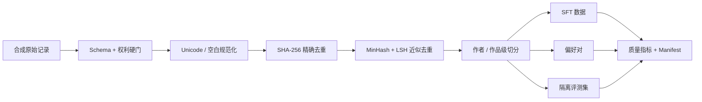

# Governed Novel Data Pipeline

[](https://github.com/JiaxinZhang-space/novel-ai-data-pipeline/actions/workflows/ci.yml)
[](https://www.python.org/)
[](LICENSE)
[](DATA_LICENSE.md)

> 独立构建的小说 AI 数据工程作品集：演示权利门禁、文本规范化、精确/近似去重、作者/作品级隔离、SFT/偏好/评测集生产、质量门禁和版本血缘。

## 项目状态与真实性边界

| 项目 | 当前状态 |
|---|---|
| 项目类型 | 独立重建的公开作品集 Demo |
| 数据来源 | 100% 确定性合成 |
| 第三方真实项目资产 | 0 |
| 模型训练 | 未执行；仅保留版本关联占位符 |
| 真实编辑、用户、发布、收入 | 未发生 |
| 构建验证 | 端到端管道 PASS，17 / 17 测试 PASS |

**SYNTHETIC_PORTFOLIO_DEMO**：本仓库是拾章项目数据处理部分的demo版本，不含其代码、小说、日志、配置、提示词、合同或经营记录。现实业务问题只用于定义工程场景；所有作品、作者、授权记录、编辑事件、实验结果和业务化标识均为合成或模拟数据。

它证明的是可运行的工程实现和验证能力，不证明模型效果、商业收入或真实生产经历。

## 解决的问题

小说数据不能“切段后直接训练”：

- 公开可读不等于允许训练、生成或商业使用；
- 相邻章节、同一作品和同作者风格跨集合会造成评测泄漏；
- SFT、偏好学习和黄金评测需要不同的数据契约；
- 只保存最终 JSONL，无法回答某个模型用了哪些来源、规则和评测版本；
- 撤回作品时，需要从权利记录反查数据集、训练运行和模型版本。

本仓库把这些要求落实成一条可重复运行的标准库 Python 管道：



完整架构和血缘见 [system_architecture.md](architecture/system_architecture.md) 与 [data_lineage.md](architecture/data_lineage.md)。

## 可复现结果

| 工程检查 | 合成回归结果 | 对应证据 |
|---|---:|---|
| 原始记录 | 27 | `artifacts/raw/raw_records.jsonl` |
| 权利硬门 | 25 通过 / 2 拒绝 | `artifacts/processed/rights_*.jsonl` |
| 精确 / 近似重复 | 2 / 3 | `duplicate_rejections.jsonl` |
| 唯一合成作品 | 20 | `canonical_stories.jsonl` |
| SFT 训练 / 验证 | 36 / 12 | `artifacts/datasets/` |
| 偏好对 / 隔离评测任务 | 24 / 30 | `artifacts/datasets/` |
| 作者 / 作品 / 正文哈希跨 split 泄漏 | 0 / 0 / 0 | `split_leakage_report.json` |
| 运行产物校验和 | 23 个文件 | `checksums.sha256` |
| 自动化测试 | 17 / 17 PASS | `tests/` |

这些数字是合成数据的回归契约，不是实际项目规模、效率提升或模型效果。完整口径见 [verification_report.md](docs/verification_report.md) 和 [Dataset Card](governance/dataset_card.md)。

## 快速运行

核心管道仅依赖 Python 标准库，要求 Python 3.10 或更高版本。

Windows PowerShell：

```powershell
.\run_demo.ps1
```

Linux / macOS：

```bash
./run_demo.sh
```

或直接运行：

```bash
python scripts/run_demo.py --output-dir artifacts
python -m unittest discover -s tests -v
python scripts/check_public_repo.py
```

管道会确定性地重建相同的合成数据、指标和 Manifest。输出目录带受管标记；程序会拒绝清理源码根目录或未受管的已有目录。

无需安装可选依赖即可打开 `artifacts/reports/overview.html`。如需交互看板：

```bash
python -m pip install -r requirements-dashboard.txt
streamlit run dashboard/app.py
```

## 面试官 2 分钟阅读路径

1. 看本页的项目边界、结果表和架构；
2. 看 [5 分钟讲解路线](docs/interview_walkthrough.md)；
3. 看 [Dataset Card](governance/dataset_card.md) 与 [数据质量契约](governance/data_quality_contract.md)；
4. 看 [release manifest](artifacts/manifests/release_manifest.json) 如何关联数据、模型占位版本与评测版本；
5. 本地执行一键管道和 17 项测试。

## 主要目录

```text
architecture/        架构、数据流与血缘
contracts/           机器可校验的数据契约
dashboard/           Streamlit 质量与实验看板
docs/                案例说明、验证报告与面试讲解
evidence/            发布、用户、收入证明的空白脱敏模板
experiments/         明确标注 DEMO 的基线、消融和盲测样例
governance/          Dataset Card、权利台账、数据字典与质量规范
manifests/           数据 / 模型 / 评测版本关联模板
scripts/             一键运行与公开发布安全检查
src/novel_evidence/  标准库实现的数据管道
tests/               单元、契约和端到端测试
artifacts/           可确定性重建的合成运行产物
```

## 已实现与未实现

已实现：

- 权利字段校验和训练用途硬门；
- NFKC / 标点 / 空白规范化；
- SHA-256 精确去重与教学型 MinHash/LSH 近重复候选检测；
- 作者优先、作品不可拆的确定性集合切分；
- SFT、偏好对和隔离评测任务派生；
- Schema、泄漏、计数、哈希和版本血缘验证；
- 输出目录防误删保护、离线报告与 CI。

未实现：

- 真实版权法律判断、合同审批或撤回执行；
- 生产级 PII / 内容安全自动检测；
- 生产级大规模相似性检索或版权侵权判断；
- 模型训练、在线推理、真实盲测、发布、用户或收入验证；
- 多编辑一致性与浏览器级 Streamlit 验收。

MinHash/LSH 在这里用于演示候选发现和回归测试，不能单独证明版权安全。

## 真实项目如何复用

公开仓库永久只保留合成数据。若用于真实项目，应在**新的私有仓库和受控存储**中复用代码结构，并执行：

1. 书面确认数据来源、权利主体、用途、期限、撤回和再分发边界；
2. 原始正文、合同和凭据进入权限隔离的对象存储，不进入本 Git 历史；
3. 增加生产级 PII、内容安全、审计日志和人工复核；
4. 冻结作者/作品分组后再派生训练和评测样本；
5. 真实数据、模型、评测和发布均生成不可变 Manifest；
6. 对外只导出经审批的聚合指标、脱敏引用和哈希。

不要在本公开仓库里“替换成真实数据”。

## 参考与许可

工程方法参考了 DataScale AI 的开源书籍 [《大模型数据工程：架构、算法及项目实战》](https://datascale-ai.github.io/data_engineering_book/)；参考快照和独立实现边界见 [ACKNOWLEDGMENTS.md](ACKNOWLEDGMENTS.md)。

代码采用 [MIT License](LICENSE)。合成数据的来源和再分发边界见 [PROVENANCE.md](PROVENANCE.md) 与 [DATA_LICENSE.md](DATA_LICENSE.md)。治理模板不构成法律意见。
