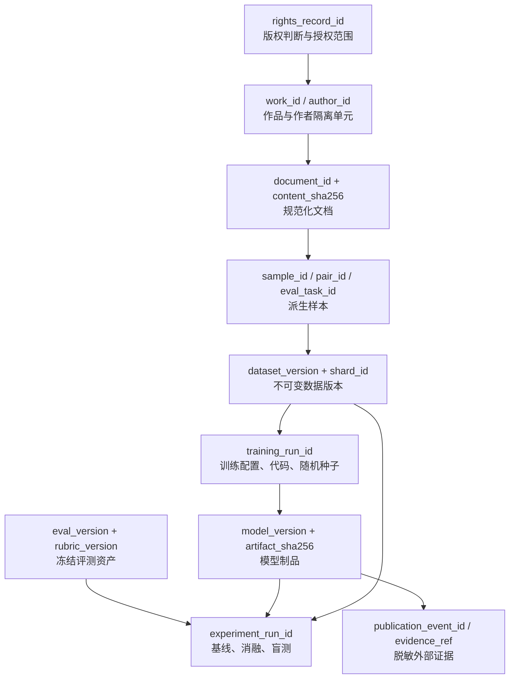
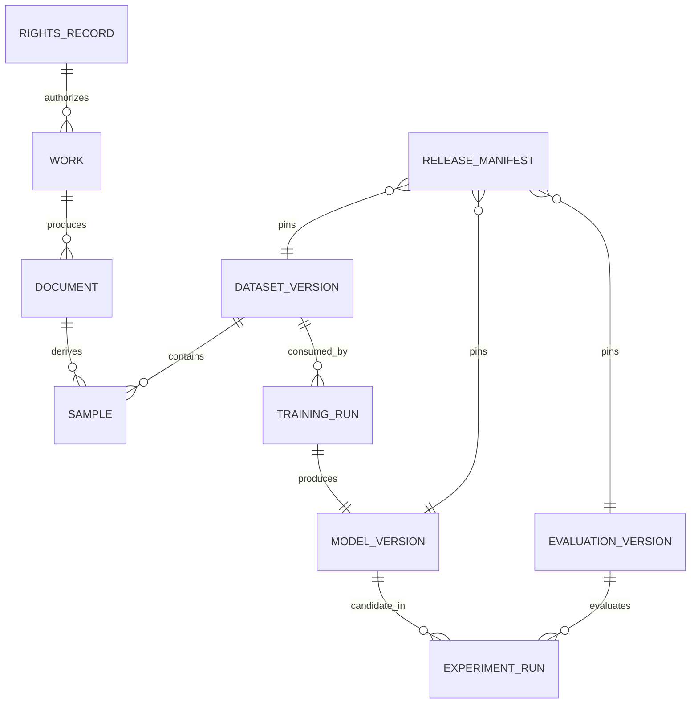
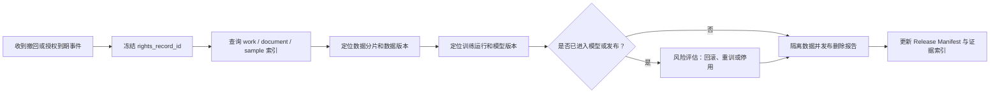

# 数据血缘与撤回路径

> 状态：`DEMO`  
> 血缘结构可用于真实项目；文档中的标识符仅为示例，不是实际业务证据。

## 1. 主血缘图

## 2. 版本关系

## 3. 权利撤回影响分析

## 4. 每条血缘边的最低证据

| 血缘边 | 最低机器可读证据 |
|---|---|
| 权利记录 → 作品 | 版权台账中的 `rights_record_id`、`work_id`、用途范围和有效期 |
| 作品 → 文档 | 处理运行 ID、源文件哈希、规范化内容哈希 |
| 文档 → 样本 | 样本中的来源作品 ID、生成规则版本和父内容哈希 |
| 样本 → 数据版本 | 数据 Manifest 中的分片路径、计数和 SHA-256 |
| 数据版本 → 训练运行 | 模型 Manifest 中冻结的数据版本和配置哈希 |
| 训练运行 → 模型版本 | 训练运行 ID、模型制品 URI 和 SHA-256 |
| 模型 + 评测 → 实验 | 实验 Manifest、随机种子、候选盲化映射和结果文件哈希 |
| 模型 → 发布证据 | 脱敏事件引用和受控证据库中的原始凭证 |

## 5. 不接受的“伪血缘”

- 只在 README 中写“使用了某数据”，没有可校验的 Manifest。
- 只保存文件名，不保存内容哈希。
- 覆盖旧模型或旧数据后继续沿用原版本号。
- 由人工记忆回答某作品是否进入训练。
- 用 DEMO 标识符替代真实合同、发布或收入凭证。

