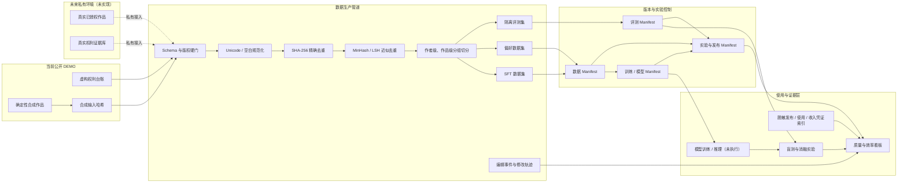

# 小说 AI 证据包：系统架构

> 状态：`DEMO`  
> 本图描述可复现的工程边界，不代表已经获得的真实版权、用户、收入或模型效果。

## 1. 端到端架构

## 2. 关键设计约束

1. **版权先于处理**：版权状态不合格的记录在进入正文处理前即被拒绝。
2. **先切分、后派生**：按作者和作品分组切分，再生产 SFT、偏好和评测样本，避免相邻章节或同作者风格泄漏。
3. **评测隔离**：黄金评测任务不得回流训练集；污染扫描结果必须写入质量报告。
4. **不可变版本**：正式数据、模型和评测版本只追加，不覆盖；变更通过新版本和 Manifest 表达。
5. **证据与结论分离**：看板展示运行产物；真实发布、用户和收入只能引用脱敏后的外部凭证，不能由 DEMO 数据推导。
6. **撤回可追踪**：通过 `rights_record_id → work_id → sample_id → dataset_version → model_version` 定位受影响资产。

## 3. 目录到组件的映射

| 组件 | 主要实现或产物 |
|---|---|
| 数据处理代码 | `src/novel_evidence/`、`scripts/` |
| 数据治理规范 | `governance/`、`contracts/` |
| 架构与血缘 | `architecture/` |
| 实验协议和样例 | `experiments/` |
| 版本关系模板 | `manifests/templates/` |
| 运行产物 | `artifacts/` |
| 指标看板 | `dashboard/app.py` |
| 真实凭证脱敏模板 | `evidence/` |

## 4. 私有生产环境需要补齐的边界

- 不在本公开仓库替换真实数据；在新的私有仓库和受控存储接入经合同复核的授权来源。
- 增加生产级 PII、内容安全与人工复核；当前 Demo 只做文本规范化。
- 将固定演示事件替换为带服务端时间戳的编辑、发布与使用事件。
- 将模板模型版本替换为实际模型制品、训练配置和制品哈希。
- 将样例实验结果替换为冻结评测集上的真实运行结果。
- 将本地文件存储升级为带权限控制、审计日志和备份策略的对象存储或湖仓。
